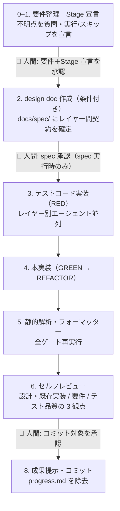

# AI-DLC 開発フローガイド（チームメンバー・新規参入者向け）

このリポジトリの機能実装は **AI-DLC（AI-Driven Development Lifecycle）** で進める。
本書は「人間メンバーとして何をすればよいか」を理解するためのガイド。
AI（Claude Code）向けの手順正本は [`.claude/skills/ai-dlc-flow/SKILL.md`](../.claude/skills/ai-dlc-flow/SKILL.md)。

## 1. AI-DLC とは（30 秒版）

- **AI が調査・設計・実装・テスト・検証を推進**し、**人間は承認ゲートで方向を決める**開発ライフサイクル。
- **全タスクが同じ単一適応フローに入る**。冒頭の **Stage 宣言**で実行/スキップを決め、複雑さに応じて詳細度を適応させる。
- 人間の仕事は「コードを書くこと」から「**要件と Stage 宣言を確定し、設計を承認し、成果を受け入れること**」に変わる。
- 品質は人間の注意力ではなく**仕組み**で担保する（必須 Stage・spec を契約とした TDD・機械的ゲート・セルフレビュー）。

## 2. 全体フロー

🧑 = **人間の承認ゲート**（深さは**リスクティア** [risk-tiers.md](../.claude/rules/risk-tiers.md) で決まる）。Gate 3 は常時ブロッキング、Gate 1 は Tier 1/2 のみブロッキング、Gate 2 は spec を実行する時だけ（さらに Gate 1 での明示オプトインで**委任**＝事後確認化もできる）。詳細は 3 章。
🔓 Stage 2（spec）は条件付きでスキップ可（基準は 4 章と [ai-dlc-flow](../.claude/skills/ai-dlc-flow/SKILL.md)）。

**メインの AI はオーケストレーター**で、実作業はサブエージェントへ並列委譲する。自分で手を動かすのは「契約の確定」と「品質ゲートの再実行」だけ。

## 3. 人間がやること（承認ゲートの見方）

### Gate 1（要件承認）: 要件確定＋Stage 宣言（Stage 0+1）【Tier 1/2 は承認・Tier 3 は宣言のみ】

AI が要件の不明点を**選択肢 + 推奨案つき**で質問し、あわせて**Stage 宣言**（7 Stage のどれを実行/スキップするか＋理由＋リスクティア）を提示してくる。

- リスクティア（[risk-tiers.md](../.claude/rules/risk-tiers.md)）に応じてこのゲートの重さが変わる: **Tier 1/2 はブロッキング承認**（AI は承認を待つ）、**Tier 3（低リスク変更。対象の定義は [risk-tiers.md](../.claude/rules/risk-tiers.md) を参照）は宣言のみで自走**し、コミット前の Gate 3 で事後確認する。
- 確認すべきこと:
  - **判定ティアが妥当か**（Tier 3 と宣言したものに Tier 1 要素が紛れていないか）。迷ったら上のティアに倒す。
  - 業務要件として正しい選択か。**変更コストが高い判断**（スキーマ・API 仕様・認証・ロール体系 ＝ Tier 1）はここで必ず確定する。
  - **Stage 宣言が妥当か**。spec（Stage 2）をスキップすると言ってきた場合、その**基準を満たしているか**（spec スキップは「単一レイヤー・IF 不変・スキーマ/API/認証/ロール不変・低リスク」を全て満たす時だけ）。必須 Stage（TDD・静的解析・コミットゲート）はスキップできない。
- 後から変えると spec 改訂 → 実装やり直しのボルトが必要になる（変えられる。が、ここで決める方が安い）。

### Gate 2（spec 承認・Stage 2）【spec を実行する時だけ】

Stage 宣言で spec をスキップした場合、このゲートは無い。実行する場合は AI が `docs/spec/<TICKET>-*/` に design doc を作成し、要点サマリを提示してくる。

- 確認すべきこと:
  - **レイヤー間インターフェース**（スキーマ / API の入出力 / ルーティング・画面）が意図どおりか
  - **AC（受け入れ基準）** が「これが満たされれば OK」と言える内容か
  - **スコープ外（やらないこと）** が妥当か
- 承認後、この spec が**実装の契約**になる。以降の乖離は「spec を先に直してから実装」が原則。

#### Gate 2 委任（オプトイン・spec 承認を「待たない」選択肢）

Gate 1 の承認時に**人間が明示的に選んだ場合に限り**、Gate 2 を「承認待ちなし」へ降格できる（**Gate 2 委任**・[risk-tiers.md](../.claude/rules/risk-tiers.md)）。

- AI は spec を**必ず作成**し、要点サマリも**必ず提示**する。変わるのは**承認待ちの有無だけ**（提示後、承認を待たずに実装へ進み、Gate 3 で実装とまとめて事後確認する）。
- **trade-off（委任の代償）**: Gate 3 で spec に NG を出すと、spec 修正 → **実装の差し戻し**（TDD・検証のやり直し）になる。この手戻りコストを受け入れるのが委任。**差し戻しが痛いボルト（契約の不確実性が高い・変更コストの高い判断を含む）では委任しない**のが正しい使い方。
- デフォルトは非委任。AI から委任を勧めてくることは無い（Gate 1 で選択肢として中立に提示されるのみ）。ティアの再宣言（昇格）があると委任はリセットされ、再オプトインを求められる。

### Gate 3（コミット承認・Stage 8）

AI が AC ごとの達成状況・証跡（テスト数 / ゲート結果）と、**コミット対象のファイルリスト**を提示してくる。

- **Tier 3 のタスクは、AI がここで Stage 宣言とティア判定根拠を再提示してくる**（Gate 1 を宣言のみで通過した分の事後確認）。判定が妥当だったかをここで確認する。
- **Gate 2 委任ボルトでは、spec 要点サマリ（委任後に doc を改訂した場合はその差分含む）もここで再提示してくる**（委任分の事後確認）。spec と実装をまとめて受け入れ判断し、spec NG なら差し戻しになる。
- 確認すべきこと: コミット粒度（レビューしやすい分割か）・入れたくないファイルが混ざっていないか・申し送り事項の妥当性。
- コミット・push は人間の承認なしには実行されない。

## 4. 各 Stage の概要

> 🔒 = 必須 Stage（スキップ不可・品質の最低保証ライン）／🔓 = 条件付き Stage（Stage 宣言でスキップ可）。詳細度は複雑さに**適応**する（過不足なく）。

| Stage | 区分 | 主体 | 内容 | 完了の証跡 |
|-------|------|------|------|-----------|
| 0+1. 要件整理＋Stage 宣言 | 🔒常時 | AI + 🧑 | 要件の精査・確定と、7 Stage の実行/スキップ宣言＋リスクティア判定。Gate 1 承認は Tier 1/2 のみ（Tier 3 は宣言のみ） | 確定事項リスト＋承認済み Stage 宣言（Tier 3 は宣言） |
| 2. design doc | 🔓条件付き | AI + 🧑 | `create-spec` スキルで spec 作成。既存実装調査は `Explore` サブエージェントへ並列委譲（Stage 2a）し、メインの AI がレイヤー間契約を具体値で確定（2b）（基準を満たせばスキップ） | 承認済み spec（実行時。委任時は提示済み spec + Gate 3 事後確認） |
| 3. テスト実装 | 🔒常時 | AI | `tdd-cycle`。レイヤー別サブエージェントが並列で契約テストを書き **RED を確認** | 全レイヤーの RED 証跡 |
| 4. 本実装 | 🔒常時 | AI | 同エージェント継続で GREEN 化 → リファクタ | 全テスト green + カバレッジ |
| 5. 静的解析 | 🔒常時 | AI | プロジェクトの静的解析・フォーマッタ・型チェック（lint / formatter / type-check）と lefthook（全チェック一括）を**メインの AI が再実行**（エージェントの自己申告を信用しない） | 全ゲート pass のログ |
| 6. セルフレビュー | 🔒常時 | AI | `self-review` スキル。①設計準拠＋既存実装整合 ②要件・仕様準拠 ③テスト品質 の 3 観点を `code-reviewer` / `spec-conformance-reviewer` / `test-quality-reviewer` の 3 体が別コンテキストで並列に証跡ベースで監査。メインの AI は Must 指摘ゼロまで修正 | レビューレポート |
| 8. 成果提示 | 🔒常時 | AI + 🧑 | AC ↔ 証跡の対応・申し送りを報告し、`progress.md` を除去してファイルリスト承認制でコミット | コミット |

## 5. フローを支える部品（ハーネス）

| 部品 | 役割 |
|------|------|
| [`docs/ai-dlc/glossary.md`](./ai-dlc/glossary.md) | AI-DLC 用語集（**正本**）。ビジネスインテント / BC / ユニット / ボルト / ステージ / ゲート / Tier / SSoT |
| [`docs/spec/`](./spec/) | 実装の契約（design doc）。`_TEMPLATE/` 準拠。`progress.md`（Stage 宣言・ゲート状態・現在位置）で中断 → 再開を復元し、完了時に除去 |
| [`docs/ai-dlc/retro/`](./ai-dlc/retro/) | 各ユニットの**振り返り学習ノート**（KPT ＋ フロー改善の還流先）。`progress.md` と違い完了後も残す永続資産 |
| [`.claude/rules/`](../.claude/rules/) | 横断ルール（リスクティア / spec 駆動 / シンプルさ / テスト / タスク・PR） |
| [`.claude/agents/`](../.claude/agents/) | レイヤー別実装サブエージェント（プロジェクトのレイヤーに対応）+ 評価エージェント（code-reviewer / spec-conformance-reviewer / test-quality-reviewer / impl-auditor）。各レイヤーの規約 docs を必読してから TDD で実装する |
| [`.claude/skills/`](../.claude/skills/) | 手順スキル: `ai-dlc-flow`（本フロー）/ `aidlc-init`（導入時初期設定）/ `import-ticket` / `create-spec` / `tdd-cycle` / `self-review` / `impl-audit` / `impl-reset` / `retro-triage` / `bolt-replay` |
|  lefthook（gitleaks + プロジェクトの lint / formatter） | 機械強制ゲート（AI が無視できない物理的なガードレール） |

### 節目に使うスキル（毎ボルトでは使わない）

- **`impl-audit`**: 大きな区切り（節目）に、実装全体の適合状態を点検する全体監査レポート（要件適合 / 設計適合 / 品質実測 / 残課題 + 総合判定 ✅⚠️❌）を作成する。
- **`impl-reset`**: 実装を破棄してハーネスだけの状態に戻す（誤った方針の作り直し時）。

## 6. 振り返り学習ループ（フローを育てる）

AI-DLC は**フロー自体を改善するループ**を内蔵する。各ユニットの学びを `docs/ai-dlc/retro/<TICKET>.md`（retro note）に残す。

- **記録**: 各 Stage の境界で notable な気づき（摩擦・想定外・判断）を軽く拾う。
- **蒸留**: 完了時（Gate 3）に KPT（Keep / Problem / Try）でまとめる。これが主役。
- **還流**: 各 Try を「ハーネスのどこを直すか」（SKILL.md / guide / rules / テンプレ / agents）へ割り付ける。還流先は [`docs/ai-dlc/retro/README.md`](./ai-dlc/retro/) の表。
- `progress.md`（揮発・再開用）と違い、retro note は **merge 後も残る永続資産**。蓄積された学びが次ボルト以降のフロー改善になる。

> v1 はここまで（記録 ＋ 振り返り ＋ 還流先の明文化）。複数 retro の横断集計の自動化は次段。spec を実行しないボルト（spec スキップ時）は対象外。

## 7. FAQ

**Q. 小さなバグ修正でもこのフローを回すのか？**
A. 同じフローに入るが、**軽くなる**。Stage 宣言で spec（Stage 2）をスキップでき、Tier 3 なら Gate 1 も宣言のみで自走する。結果として「（Tier 3 は宣言のみ）→ TDD → 静的解析 → セルフレビュー → コミット承認」の軽量パスになる。**必須 Stage**（TDD・静的解析・コミットゲート）は小修正でも外れない。

**Q. 作業を中断したら、次のセッションでどう再開するのか？**
A. AI は**決まった読み順**（[ai-dlc-flow](../.claude/skills/ai-dlc-flow/SKILL.md) の「中断 → 再開」節）で復元する: ① spec の `index.md`（契約）→ ② `progress.md`（現在位置・ゲート状態・次の一手）→ ③ engine state（あれば）→ ④ `git status` / diff（実物）→ ⑤ retro note（あれば）。読んだ内容が食い違ったら実物（git / ディスク）を正とする。`progress.md` はブランチ中だけ存在し、機能完了時（コミット承認前）に除去される（main には残さない）。spec を実行しないボルトには作らない。

**Q. AI の成果は誰がレビューするのか？**
A. 三段構え。① AI 自身のセルフレビュー（Stage 6。別コンテキストで証跡ベース監査）② 機械ゲート（lint / arch lint / カバレッジ）③ 人間 + AI（Codex 等）による PR レビュー（[task-and-pr.md](../.claude/rules/task-and-pr.md)）。

**Q. 実装中に spec と違うことが必要になったら？**
A. AI は実装を止めて spec を先に更新し、変更点を報告してくる。spec が常に実装の正本（[spec-driven.md](../.claude/rules/spec-driven.md)）。

**Q. AI が要件を勝手に解釈して進めてしまわないか？**
A. ハーネスで多重に防いでいる。不明点は推測せず質問する（spec-driven）・spec に無い抽象化を足さない（simplicity / YAGNI）・サブエージェントには担当範囲外の変更を禁止。さらにセルフレビューの観点 B が「スコープ外への踏み込み」を検査する。

**Q. 実装が設計・要件に沿っているか、節目でどう点検するのか？**
A. 節目に `impl-audit` で全体監査レポートを作成し、総合判定（健全 ✅ / 要対応 ⚠️ / 重大 ❌）と残課題リストを材料に人間が判断する。
